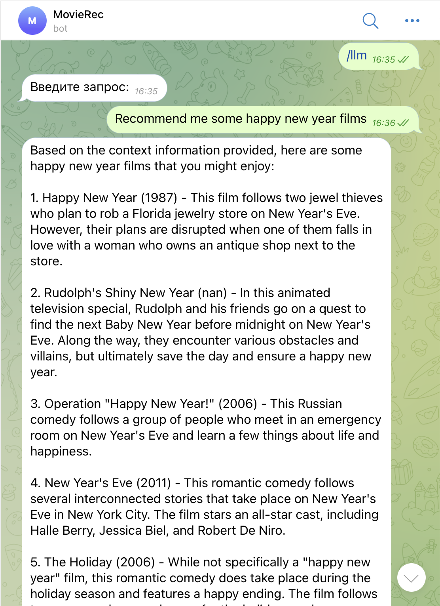

# Описание проекта
Проект ориентирован на построение рекомендательной системы, объектом рекомендаций являются фильмы. Основной фокус данной работы — использование Больших Языковых Моделей (LLMs) как средства получения лучшей персонализации и учета особенностей запроса, a также как универсального связующего звена между пользователем и системой. 

Основу рекомендательной системы будет составлять LLM с использованием техники Retrieval Augmented Generation (RAG). Retrieval система будет основана на векторной базе данных с использованием близости текстовых эмбеддингов кратких описаний фильмов. Таким образом, наша рекомендательная система, в отличие от большинства устоявшихся подходов, будет являться "content based", то есть будет опираться в большей степени на специфику запроса пользователя, нежели на множество предыдущих понравившихся фильмов и набор эвристик.

В дальнейшем будут проведены допольнительные эксперименты по улучшению рекомендаций, в том числе с помощью различных алгоритмов кластеризации данных, дополнительной обработки эмбеддингов (metric learning finetune на наших данных) и внесения эвристик (таких как ранжирование рекомендаций в соответствии с рейтингом фильма и т.д.)

Доступ к ответам рекомендательной системы будет предоставляться с помощью развернутого веб-сервиса и Telegram бота.

# План работы

- Разведочный анализ данных и первичная аналитика данных
    - Исследование фичей в выбранном датасете: текстовые, числовые, категориальные, графовые (граф связей фильмы - актеры)
    - Очистка данных (заполнение пропусков, поиск выбросов)
    - Объединение датасета кратких описаний фильмов с датасетом оценок пользователей, необходимого для оценки качества работы рекомендательной системы и сравнения с бейзлайн решением
    - Получение эмбеддингов из Больших Языковых Моделей (LLMs) для кратких содержаний фильмов
      
- Построение бейзлайн решения рекомендательной системы с использованием одного или нескольких популярных подходов, таких как Matrix Factorization Techniques (SVD, PCA или LSH), Collaborative Filtering и т.д.
  
- Построение RAG пайплайна рекомендательной системы
    - Создание Retrieval системы на основе векторной базы данных, содержащей текстовые эмбеддинги кратких описаний фильмов
    - Построение первоначальной версии рекомендательной системы на основе полученной Retrieval системы
    - Тестировние первоначальной версии рекомендательной системы на датасете оценок пользователей, подбор оптимальных гиперпараметров и выбор модели для получения текстовых эмбеддингов
    - Построение рекомендательной системы на основе LLM с использованием контекста из Retrieval системы
    - Проведение экспериментов с prompt engineering для повышения стабильности и качества работы Языковой Модели
    - Тестирование различных open source моделей и выбор оптимальной (ручное тестирование или автоматизированное с использованием GPT-4)

- Проведение экспериментов по интеграции дополнительных компонентов, улучшающих качество работы рекомендательной системы
    - Исследование алгоритмов кластеризации фильмов на основе доступных в датасете метаданных (K-means, Hierarchical Clustering, DBSCAN, ...)
    - Тестировние качества работы RAG системы с использованием полученной кластеризации при получении контекста из Retrieval системы
    - Тестировние качества работы RAG системы с использованием различных эвристик (таких как ранжирование рекомендаций в соответствии с рейтингом фильма) при получении контекста из Retrieval системы

- Использование методов DL для улучшения качества рекомендательной системы
    - (optional) Дообучение эмбеддингов для текстовых описаний фильмов с помощью подходов Metric Learning


# Описание данных
[Данные](https://disk.yandex.ru/d/7x7kfmsQTR3-Kw) представлены в виде 42 306 кратких описаний сюжетов фильмов, а также метаданных как на уровне фильма (кассовые сборы, жанр, дату выпуска и тд), так и на уровне персонажей (пол, возраст и тд).

1. plot_summaries.txt

Краткое описание сюжетов фильмов, полученных из англоязычной Википедии (данные от 2 ноября 2012 года). Каждая строка состоит из id фильма в Википедии (связь с movie.metadata.tsv), за которым следует краткое описание.

2. movie.metadata.tsv

Метаданные 81,741 фильмов, собранные из Freebase (данные от 4 ноября 2012 года). Состав данных ([Nan] - с пропущенными значениями):
- ID фильма в Википедии 
- ID фильма в Freebase
- Название фильма
- Дата выпуска [Nan]
- Кассовые сборы [Nan]
- Длительность [Nan]
- Языки ({Freebase ID:Название})
- Страны ({Freebase ID:Название})
- Жанры ({Freebase ID:Название})

3. character.metadata.tsv

Метаданные 450,669 персонажей фильмов из movie.metadata.tsv, собранные из Freebase (данные от 4 ноября 2012 года). Состав данных ([Nan] - с пропущенными значениями):
- ID фильма в Википедии
- ID фильма в Freebase
- Дата выпуска [Nan]
- Имя персонажа [Nan]
- Дата рождения актера [Nan]
- Пол актера [Nan]
- Рост актера (в метрах) [Nan]
- Этническая принадлежность актера (Freebase ID) [Nan]
- Имя актера [Nan]
- Возраст актера на момент выхода фильма [Nan]
- общий ID для персонажа и актера в Freebase
- ID персонажа в Freebase [Nan]
- ID актера в Freebase [Nan]

# Примеры использования сервиса
<p align="center">
  
  
  
</p>
<p style="margin-bottom: 160px; font-size: 12px;"align="center">Примеры запроса к LLM для получения рекомендации<br><br><br></p>

<p align="center">
  
  
  
</p>
<p style="margin-bottom: 60px; font-size: 12px;"align="center">1. Без использования LLM (запрос к векторной базе)<br>2. С использованием LLM<br>3. С использованием LLM (модель сама понимает, что интересны фильмы не из той же серии)</p>


# Описание функционала сервиса/бота

Описание команд тг бота (каждой команде соответствует свой эндпоинт сервиса):

- /llm (сервис - /predict_item)
	- запрашивает у пользователя описание фильма (англ.)
	- ответ - это текст с рекомендациями, сгенерированный LLM (англ.)

- /rec (сервис - /predict_item) 
	- после вызова в 2 этапа запрашивает у пользователя описание фильма (англ.) и количество рекомендаций для этого описания (от 1 до 10)
	- ответ состоит из запрошенного количества рекомендаций, состоящих из (англ.):
		- название фильма
		- дата/год премьеры
		- продолжительность
		- язык(-и) озвучки
		- жанр(-ы) фильма
		- описание

- /batch_rec (сервис - /predict_items)
	- после вызова в 2 этапа запрашивает у пользователя несколько описаний фильмов (англ.) и количество рекомендаций(от 1 до 10 - для всех описаний будет выбранное число)
	- ответ состоит из запрошенного количества рекомендаций для каждого описания, состоящих из (англ.):
		- название фильма
		- дата/год премьеры
		- продолжительность
		- язык(-и) озвучки
		- жанр(-ы) фильма
		- описание

- /topbox (сервис - /top_box_office)
	- команда вызывается с указанием количества фильмов (от 1 до 15)
	- ответ состоит из запрошенного количества фильмов со следующей информацией (англ.):
		- название фильма
		- дата/год премьеры
		- кассовые сборы

- /actor (сервис - /actor_info)
	- команда вызывается с указанием ФИ актера (англ.)
	- ответ состоит из следующей информации о запрошенном актере (англ.):
		- ФИ
		- пол
		- рост
		- дата рождения

- /film (сервис - /film_info)
	- команда вызывается с указанием названия фильма (англ.)
	- ответ состоит из следующей информации о запрошенном фильме(-ах), т к есть фильмы с одинаковым названием (англ.):
		- название фильма
		- дата/год премьеры
		- продолжительность
		- кассовые сборы

# Инструкция для запуска
__Описание docker-compose:__

В данном сервисе поднимаются 2 объединенных докер контейнера с веб-приложением (FastApi для взаимодействия с рекомендательной системой) и сервером Redis (для кеширования запросов). При этом мы дополнительно резервируем для запуска системы 1 gpu (минимум 13 гб видеопамяти и 16гб оперативной памяти), так как рекомендательная система включает в себя ресурсоемкую LLM.

__Для развертывания сервиса выполните команду:__

```console
docker-compose up --build
```

# Список членов команды
* Матренок Семён Сергеевич
* Павар Юрий Александрович 
* Малюшитский Кирилл Дмитриевич

